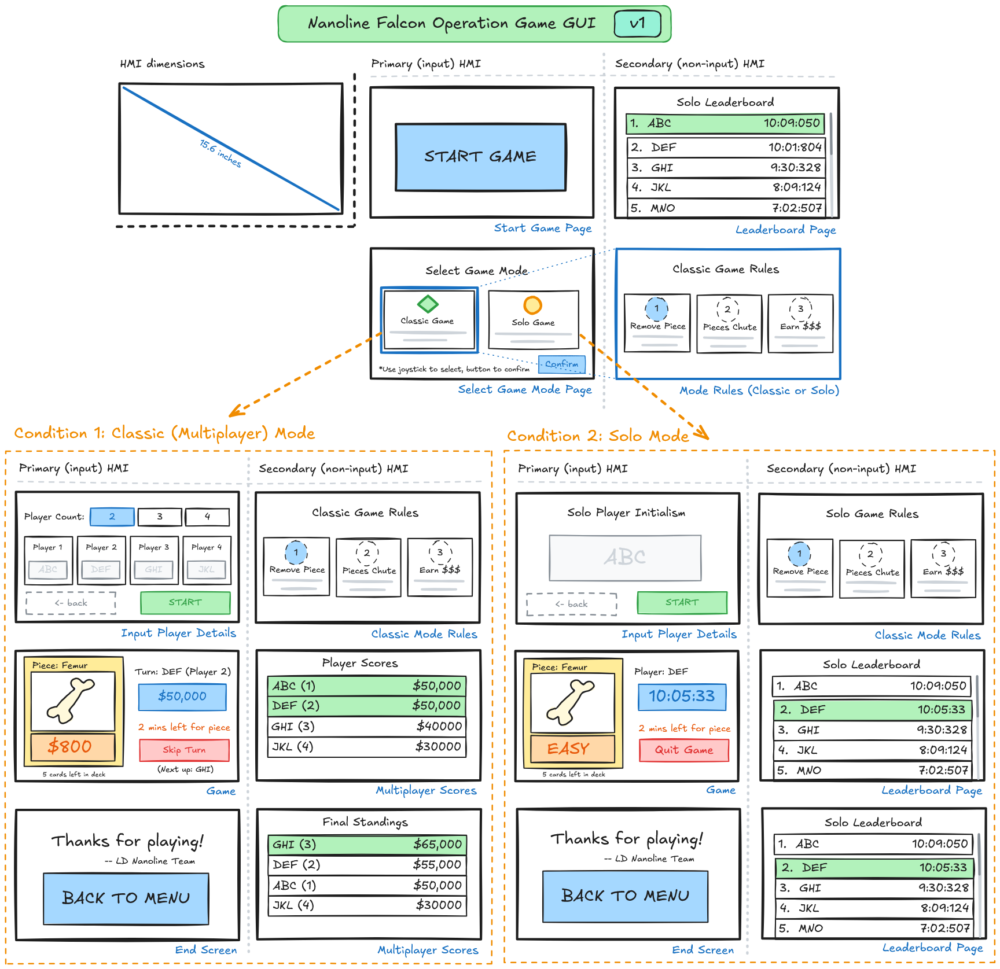

<h1>Operation: Falcon Nation</h1>

🦅 An automated board game reimagining which elevates scale, sensory experience, and interactivity. Featuring a life-size gameboard, themed pieces, and game mechanics, the project serves philanthropic causes and events.

----------------------------------

<kbd>Table of contents</kbd>

#### TOC

- [✨ Features](#-features)
- [🚀 Usage](#-urage)
  - [How to Operate](#how-to-operate)
  - [Game Mode Overview](#game-mode-overview)
  - [How to Play](#how-to-play)
- [📊 Flowcharts](#-flowcharts)
  - [Logic](#logic)
  - [GUI](#gui)
  - [Debugging](#debugging)
- [🍱 Piece/Cavity Descriptions](#-piece-cavity-descriptions)
  - [List of pieces](#list-of-pieces)
  - [Cavity Anatomy](#cavity-anatomy)
- [💾 Programming Documentation](#-programming-documentation)
  - [Tasks](#tasks)
  - [Function Blocks](#function-blocks)
  - [Variables](#variables)
- [🔌 Electrical Wiring Diagram](#-electrical-wiring-diagram)
- [🗺 Monorepo Layout](#-monorepo-layout)

####

## ✨ Features

* Automatic piece-removal detection
* Circuit-based tong penalty loop
* Score-keeping and dynamic leaderboards
* Haptic-feedback-enabled modified kitchen tongs
* Multicolor board-and-cavity game state lights
* 11 custom-themed game pieces & cavities
* Two touchscreen web panel displays
* Two (repurposed car) speakers & immersive audio
* Plug-and-outlet power for project & tongs

## 🚀 Usage

### How to Operate

1. Plug in the power input located near the red switch on the left wall of the project, positioned closest near the falcon's head.
2. Press the red power switch located next to the power input and confirm that fans, web panels, and PLC (through glass) are powered and/or booting.
3. When the panel begins to display timers (typically 5 second countdowns), wait until a new calibration page with "LEFT" and "RIGHT" buttons. On the left panel, press "LEFT" and on the right one press "RIGHT".
4. The next page will be a sensor setup page that will indicate for which cavities the sensors are currently detecting a piece.
5. When all pieces are detected or early if necessary (pieces are lost, sensors are broken), press start and you will be navigated to the home (splash) screen.
6. From here, select a game mode and proceed through the steps of inputting player count, "nicknames", and confirmation.
7. Proceed to play Operation: Falcon Nation!

### Game Mode Overview

#### Demo Mode
In demo mode, a simplified "classic" mode variant, only four of the game's eleven total pieces are enabled, allowing a faster, more streamlined experience for showcases and demonstrations of the project.

#### Multiplayer (Classic) Mode
This version of the game operates most similarly to the original game, with all pieces activated. Without a stopwatch, the goal of this game is to compete for the highest monetary score.

#### Singleplayer (Blitz) Mode
As a singleplayer game, players of blitz mode aim to remove every piece in the least (or record) possible amount of time.

### How to Play

1. Presuming that game has been calibrated and configured, a "Play Game" button would become active on the left web panel screen.
2. When this button is clicked, the main game screen will appear, with the first player's piece assignment being displayed on the left panel and the initial (blank) leaderboard on the right.
3. This player must now attempt to take the assigned piece out of its cavity. If they fail, red lights will shine but if they succeed, green lights.
4, The leaderboard on the right will update with money counts accordingly and the "end game" button allows the game to be exited early.
5. When the game ends and the deck has been emptied, the final leaderboard and a thank you message will appear.

## 📊 Flowcharts

### 

Logic
 

### 

GUI
 

### 

Debugging
 

## 🍱 Piece/Cavity Descriptions

### List of Pieces

| Piece Icon | Card Design | Name | Value |
|------------|-------------|------|-------|
|  |  | LD Insignia | $500 |
|  |  | Football | $200 |
|  |  | Jersey | $100 |
|  |  | Hockey Stick | $400 |
|  |  | Music Note | $700 |
|  |  | Paintbrush | $600 |
|  |  | Chess King | $800 |
|  |  | Feather | $900 |
|  |  | Bone | $400 |
|  |  | Apple | $1000 |
|  |  | Flask | $300 |

### Cavity Anatomy

(Top-to-bottom)

1. Conductive Cavity Wall
2. Cavity Bracket
3. Clear "Light Refractor" Panel
4. Cavity Light Shell
5. Light Strip in Channel

## 💾 Programming Documentation

### Tasks

#### `Main`
- **Type:** Cyclic (100 ms)
- **Description:** Runs all game functions depending on what part of game player is at

#### `Sounds`
- **Type:** Cyclic (100 ms)
- **Description:** Receives variable changes and triggers MP3 trigger outputs to play game sounds

#### `Startup`
- **Type:** Startup
- **Description:** Resets variables and sets constants

### Function Blocks

- **`CalcWinningPlayer`** - Calculates which player(s) is winning to display on HMI and decide on winners

- **`CheckAllPiecesInCavity`** - Checks whether all distance sensors are activated to determine whether game is ready to start

- **`CheckPieceInCavity`** - Checks whether a specific piece's distance sensor is activated

- **`CheckTouchingCavity`** - Checks whether the tongs are touching a piece's conductive sides

- **`DealWithPiece`** - For the current target piece, checks whether touching the cavity and whether the piece has been removed, then triggers either success or failure of piece

- **`FormatName`** - Formats a player's name to be all caps and a maximum of three letters long

- **`GetNewPiece`** - Randomly assigns a new piece and a new target player to remove it; if all pieces have been removed, ends game

- **`LightEmptyCavities`** - Lights up the cavities that are empty with white and those with pieces in green

- **`MultiPlayerLoop`** - Sets target player variables for HMI and runs `DealWithPiece` for the current piece
  
- **`NumPiecesInCavities`** - Gets the number of cavities that currently contain pieces

- **`RandomNumber`** - Generates and returns a random number, capped at a provided maximum

- **`ResetBetweenGames`** - Resets game variables before each game

- **`SetAllLights`** - Utility, sets the colors of all lights to the colors specified as inputs

- **`SetHMIPiecevars`** - Utility, sets variables linked to HMI tags for distance sensors

- **`SetLights`** - Utility, sets lights for a specific cavity in inputs colors

- **`UppercaseLetter`** - Utility, converts letter to all uppercase

### Variables

#### Light Outputs
- **`cav{#}{color}`** - Each cavity has 4 boolean variables for RGBA where {#} is an integer 1-11 and {color} is red, green, blue, or white
- **`board{color}`** - There are 4 boolean variables for the entire board's lighting

#### Sound Outputs
- **`{sound_name}_sound_out`** - There are 9 boolean variables for controlling sound where sound_name is intro, hawk, fail, success, winner, or p{num} where {num} is an integer 1-4

#### HMI Page Variables and Flags
- **`CurrentPage`** - Current page identifier
- **`P{piece_num}_in`** - Variables linked to HMI tags for each piece's distance sensor
- **`HMInum`** - Integer representing which HMI panel is being run (1 or 2)
- **`simulator_touched_sides`** - Simulator variable for testing
- **`simulator_piece_in_cav`** - Simulator variable for testing
- **`EndGameEarly`** - Boolean representing whether end game early button has been clicked

---

## 🔌 Electrical Wiring Diagram

### 🗺 Monorepo Layout

This monorepo includes all of the components of the project one would need to reproduce, update, or extend the original version contained within. The specific documentation most relevant to this objective are:

* `/src` - The PLCNext Engineer project codebase
* `/docs/WIRING.png` - The electrical wiring configuration
* `/3d` - The 3d-print-ready piece and cavity files
* `/diy` - The wood, glass, tong, and vinyl construction (WIP)
* `/assets` - Files related to art, SFX, music, and branding
* `/diy/EXPENSES.md` - A budgeted list of components (& sources!)

__Operation: Falcon Nation - An LD Nano Team Production__

[back-to-top]: https://img.shields.io/badge/-BACK_TO_TOP-black?style=flat-square
